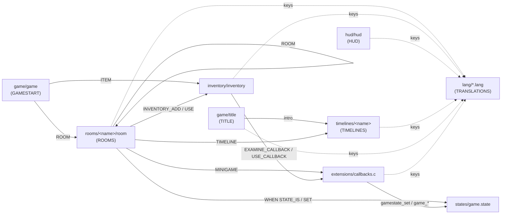

# Developing for the moteur-3ds engine

This document is for developers who want to modify the game or write a
new adventure with this engine. It explains how the description files
relate to one another, then details the part that requires C: the
**extensions** (`extensions/`), that is, the mini-games and the
inventory callbacks.

Each file format has its own documentation, referenced throughout the
text and summarized at the end (section 8).

## 1. Overview

The engine is deliberately split into two layers:

-   **the data** (`resources/`): declarative text files (rooms,
    inventory, HUD, timelines, translations...) and their assets (PNG,
    `.raw`, `.ogg`). Everything that makes up the adventure's content
    lives here, with no need to recompile the engine... except to
    rebuild the romfs;
-   **the code** (`source/` for the engine, `extensions/` for
    game-specific code). The engine knows no room, no item, no puzzle:
    it interprets the data. What the data cannot express (a keypad, a
    Simon game, a piano...) is written in C in `extensions/` and plugged
    into the engine by a **name**.

That name is the only contract between the two layers: a script says
`MINIGAME digicode` or `USE_CALLBACK inject_syringe`, and
`extensions/callbacks.c` maps that name to code.

### 1.1. Start-up

```text
main()
├── lang_init()                       romfs:/lang/*.lang
├── gamestate_init()                  romfs:/states/game.state
├── audio_init()                      (no DSP firmware: silent game, no error)
└── game_init()
    ├── callbacks_init()              init() of every inventory callback
    ├── game_config_load()            romfs:/game/game
    ├── inventory_init()              romfs:/inventory/inventory (+ callback resolution)
    ├── hud_init()                    romfs:/hud/hud
    └── game_title_start()            romfs:/game/title
```

Then, on every new game (`game_start`) or load (`game_load`):
`callbacks_reset()`, reset of the inventory, the states and the timer,
then entry into the room set in `romfs:/game/game` (or restoration of
the save).

At exit, `main()` calls `game_close()` before `audio_close()` and
`C2D_Fini()`: it closes the active mini-game, the room, the title
screen, the timeline and the music, then the HUD, the inventory and,
last, every inventory callback (`callbacks_close()`).

### 1.2. Game modes

The whole game loop is driven by `GameMode` (`source/game.h`). It is
the key to understanding who receives the input at any given moment:

| Mode            | Who receives the input                               | How to leave it                            |
|-----------------|------------------------------------------------------|--------------------------------------------|
| `GAME_TITLE`    | the title screen                                     | new game, load                             |
| `GAME_TIMELINE` | the running timeline                                 | `END` (title screen) or `RETURN` (the game) |
| `GAME_NORMAL`   | the room (movement, touch) and the inventory         | an action changes the mode                 |
| `GAME_MESSAGE`  | nobody: A, B or touch closes the message             | A, B, touch, START                         |
| `GAME_BUSY`     | nobody, for the duration of a `WAIT_SFX`             | end of the sound, then optional callback   |
| `GAME_MINIGAME` | the active mini-game (`update`)                      | `game_minigame_stop()`                     |

The START menu sits on top of all this and takes all the input while it
is open. Saving is only offered in `GAME_NORMAL`: **you never save in
the middle of a mini-game**, which has consequences for their design
(section 5.4).

## 2. From `resources/` to the romfs

All the content lives in `resources/`. The `Makefile` turns it into
`romfs/`, which is embedded in the `.3dsx` / `.cia`:

-   every directory that contains PNG files gets an automatically
    generated `gfx.t3s`, compiled by `tex3ds` into `gfx.t3x` (the
    spritesheet) and `gfx.h` (the `#define gfx_<name>_idx <n>` table);
-   `.raw` files (sound effects), `.ogg` files (music) and description
    files are copied as is;
-   `resources/rooms/hall/door.png` therefore becomes the image `door`
    of the spritesheet `romfs:/rooms/hall/gfx.t3x`.

Direct consequence: **an image is always referred to by the name of its
PNG without the extension**, and only within the directory where it
lives. A room cannot use an image from another room, nor an image from
the inventory.

Adding a file to `resources/` requires no change to the `Makefile`. See
[BUILD.en.md](./BUILD.en.md) for building.

> **Image lifetime.** `gfxmap_load_assets` fills a `GfxAssets`: the
> spritesheet plus its own name → index table, independent of every
> other load (room, timeline, mini-game...). `gfxmap_get_image` can
> therefore be called at any time while those assets are loaded. A
> `C2D_Image` stays valid until `gfxmap_free_assets` frees its
> `GfxAssets`.

### 2.1. Preparing sounds and music

The engine plays two audio formats, which the `Makefile` copies without
converting them. They must therefore be prepared beforehand with
**ffmpeg** (installed on your machine; it is not part of the devkitPro
toolchain). Two scripts in `scripts/` do it from a WAV file.

| Use                                  | Format                                       | Script                       |
|--------------------------------------|----------------------------------------------|------------------------------|
| Music (`MUSIC`, `MUSIC_START`)       | `.ogg` Ogg/Vorbis, mono or stereo, any rate  | `scripts/music_generator.sh` |
| Sound effect (`SFX`, `WAIT_SFX`, `sfx_play()`) | `.raw` headerless PCM, mono, signed 16-bit little-endian, 22050 Hz | `scripts/sound_generator.sh` |

**Music.**

```sh
scripts/music_generator.sh path/to/background.wav
```

writes `resources/audio/background.ogg` (Vorbis, 64 kbit/s), which the
game then refers to as `romfs:/audio/background.ogg`. The command it
runs is:

```sh
ffmpeg -i background.wav -c:a libvorbis -b:a 64k resources/audio/background.ogg
```

The channel count and the sample rate of the source are kept. The music
is streamed while it plays and **loops** back to the start at the end
of the file, so cut the source on a clean loop point. A file with more
than two channels is refused without a message: add `-ac 2` to the
command for a 5.1 source. To put the music elsewhere (next to a
timeline, for a relative `MUSIC_START`), run the `ffmpeg` command
yourself with the right output path.

**Sound effects.**

```sh
scripts/sound_generator.sh path/to/door_open.wav rooms/hall
```

The second argument is the destination directory, relative to
`resources/` (created if needed): here `resources/rooms/hall/door_open.raw`,
which the room `hall` can play with `SFX door_open`. The command it
runs is:

```sh
ffmpeg -i door_open.wav -ac 1 -ar 22050 -f s16le resources/rooms/hall/door_open.raw
```

A `.raw` file has no header: nothing tells the engine its format, so
a file converted with other settings still plays, but at the wrong
speed and pitch, or as noise. An effect is loaded entirely in memory
each time it is played, and at most four effects play at once: keep
them short.

**Referring to a sound or a music.** In description files, a sound or
a music is written either as a relative name **without extension**,
resolved from the directory of the file that uses it, or as an absolute
path starting with `romfs:/`, used exactly as written: no extension is
added, so write it in full (`romfs:/audio/toto.raw`):

| Directive                                   | `toto` resolves to                  |
|---------------------------------------------|-------------------------------------|
| `SFX`, `WAIT_SFX` in `rooms/<room>/room`    | `romfs:/rooms/<room>/toto.raw`      |
| `MUSIC_START`, `SFX` in `timelines/<name>/timeline` | `romfs:/timelines/<name>/toto.ogg` / `.raw` |
| `MUSIC`, `SFX_SELECT`, `SFX_CHOICE` in `game/title` | `romfs:/game/toto.ogg` / `.raw` |
| `MUSIC` in `game/game`                      | `romfs:/game/toto.ogg`              |

`romfs:/mypath/toto.raw` (or `.ogg`) works everywhere, which lets
several rooms or timelines share a file, for example in
`resources/audio/`. From C, `sfx_play()` and `music_play()` always
expect a full absolute path, extension included.

Both scripts expect a `.wav` file: the output name is the input name
without its `.wav` extension. For another source format, run the
`ffmpeg` command directly.

## 3. Description files and how they are linked

### 3.1. Dependency map



In short, four "namespaces" tie everything together:

| Namespace                   | Declared in                          | Used by                                              |
|-----------------------------|--------------------------------------|------------------------------------------------------|
| Room identifiers            | name of the `rooms/<name>/` directory | `game/game` (`ROOM`), `ROOM` actions, save          |
| Item identifiers            | `ITEM <id>` in `inventory`           | `game/game` (`ITEM`), `INVENTORY_ADD/REMOVE`, `USE`, `WHEN INVENTORY_HAS`, extensions |
| States (flags)              | `states/game.state`                  | `WHEN STATE_IS`, `SET`, extensions (`gamestate_*`)   |
| Translation keys            | `lang/*.lang`                        | every description file, extensions (`lang_get`)      |

Plus two namespaces that point to C: the names of **mini-games** and
of **inventory callbacks**, declared in `extensions/callbacks.c`.

> None of these links is checked globally at build time. Mini-game and
> callback names are checked at load time: a typo makes the room or
> inventory load fail, with the line number in the logs. A misspelled
> state or translation key, however, only produces a warning, or
> nothing at all, and a feature that does nothing. Either way, read the
> logs (section 3.11).

### 3.2. `game/game` — the entry point of a game

Sets the first room (`ROOM`), the background music (`MUSIC`), the
starting inventory (`ITEM`) and the style of the message boxes.
→ [GAMESTART.en.md](./GAMESTART.en.md)

```text
ROOM hall
MUSIC romfs:/audio/background.ogg
ITEM REVOLVER
```

### 3.3. `game/title` — the title screen

Menu, music, controls page, credits. It is the one that starts the `intro`
timeline and then the game.
→ [TITLE.en.md](./TITLE.en.md)

### 3.4. `rooms/<name>/room` — the rooms

The heart of the adventure: conditional images, hotspots, `ACTION` and
`USE` blocks, exits. This is **the** file that links all the others: it
reads and writes states, manipulates the inventory, shows messages,
starts timelines and mini-games.
→ [ROOMS.en.md](./ROOMS.en.md)

```text
HOTSPOT CRYOROOM_PANEL_CONTROL 145 102 22 26
    MESSAGE CRYOROOM_PANEL_CONTROL_MESSAGE
    ACTION
        WHEN STATE_IS cryoroom_digicode_enabled true
        MINIGAME digicode
    END_ACTION
    ...
END_HOTSPOT
```

A room's images are looked up in its own directory, and so are its
sounds given by a relative name (`SFX door_open`); a sound can also be
given by its absolute path (section 2.1).

### 3.5. `inventory/inventory` — the item catalogue

This format has no dedicated documentation yet. Each item is declared
like this:

```text
ITEM <id> <name_key>
IMAGE <image>                          # required, in resources/inventory/
EXAMINE <text_key>                     # optional: text shown when examining (X)
DETAIL <image> <x> <y> [FULLSCREEN]    # optional: image shown when examining
EXAMINE_CALLBACK <name>                # optional: C drawing while examining
USE_CALLBACK <name>                    # optional: replaces using the item (A)
END_ITEM
```

Real example:

```text
ITEM PAPER ITEM_PAPER
IMAGE paper
EXAMINE ITEM_PAPER_EXAMINE
EXAMINE_CALLBACK secret_code
END_ITEM
```

The `<id>` is the one used by rooms (`INVENTORY_ADD PAPER`,
`USE PAPER`). An item can only be examined if it has at least a
`DETAIL`, an `EXAMINE` or an `EXAMINE_CALLBACK`. Callbacks are detailed
in section 6.

### 3.6. `hud/hud` — the top screen interface

Positions and images of the inventory, the directions, the selected
item, the target and the timer. Purely visual: it only references
images from `resources/hud/` and translation keys.
→ [HUD.en.md](./HUD.en.md)

### 3.7. `timelines/<name>` — scripted sequences

Intro, endings, game overs, cut-scenes. Started by the title screen, by a
room's `TIMELINE` action, by the HUD timer, or from C with
`game_timeline_start()`. The script's last line decides what follows:
`END` goes back to the title screen, `RETURN` goes back to the room the
timeline was started from.
→ [TIMELINES.en.md](./TIMELINES.en.md)

### 3.8. `states/game.state` — progress states

A list of boolean flags, one per line, with their type:

```text
livingroom_piano_opened TOGGLE
livingroom_secret_passage_opened KEEP
```

-   `TOGGLE`: every `SET` inverts the value (door open/closed);
-   `KEEP`: the first `SET` sets it to `true`, later ones do nothing
    (irreversible event).

Every flag is `false` at the start of a game. Only flags set to `true`
are saved. A flag must be declared here before it is used, in a room as
well as in an extension. The subtleties of `SET` are described in
[ROOMS.en.md](./ROOMS.en.md).

### 3.9. `lang/*.lang` — translations

`KEY=value` lines, one file per language. Every visible string goes
through a key, including those of extensions (`lang_get`). A missing
key is displayed as is, which makes omissions easy to spot in game.
→ [TRANSLATIONS.en.md](./TRANSLATIONS.en.md)

### 3.10. Walkthrough: from the paper to the end of the game

To see all these files working together, let's follow the secret code:

1.  At the start of every game, `callbacks_reset()` calls
    `secret_code_reset()`, which draws a 4-digit code
    (`extensions/secret_code.c`).
2.  A room gives the `PAPER` item (`INVENTORY_ADD PAPER`).
3.  The player examines it: the inventory shows `ITEM_PAPER_EXAMINE`
    (translation), then calls `secret_code_draw()`, declared by
    `EXAMINE_CALLBACK secret_code`, which draws the code.
4.  In the `cryoroom`, the panel hotspot starts `MINIGAME digicode`.
5.  `digicode` compares the input with `secret_code_get()`. On
    success, it reads the `item_syringe_injected` state...
6.  ...set by the `SYRINGE` item (`USE_CALLBACK inject_syringe`
    → `syringe_use()` → `gamestate_set("item_syringe_injected")`).
7.  Depending on that state, `digicode` starts the `ending` or
    `gameover_bacteria` timeline.
8.  If the player saves in the meantime, the code is written to the
    save (`CALLBACK secret_code 4821`) by `secret_code_serialize()`,
    and read back by `secret_code_deserialize()`.

Four data files, three extensions, one state, one item: this is exactly
the kind of chain you build for a puzzle.

### 3.11. Reading the logs

All load errors (file, line number, unknown name) and engine warnings
go through `printf`. On the console, this output is only visible in a
build compiled with `DEBUG`: `main.c` then redirects `stdout` and
`stderr` to the machine that sent the game with `3dslink`.

To receive these messages, you must launch the game with
**`3dslink --server`** (short form: `-s`). Without this option,
`3dslink` exits as soon as the `.3dsx` has been sent, and nobody is
listening for the logs anymore.

```sh
make DEBUG=1
3dslink --server -a <3ds_ip_address> moteur.3dsx
```

The 3DS must be on the Homebrew Launcher, waiting for a network
connection (Y button). The logs are then shown in the terminal until
the game is closed, for example:

```text
romfs:/rooms/cellar/room:87: unknown mini-game switchbaord
Cannot load rooms: romfs:/rooms/cellar
```

## 4. Extensions: the principle

The `extensions/` directory holds all the adventure-specific code. It
is compiled together with the engine (`SOURCES := source extensions`
in the `Makefile`), nothing to configure.

The only entry point is the `extensions/callbacks.c` registry, which
exposes two tables:

```c
static MiniGameCallback minigame_callbacks[] = {
    { "simon",    &simon },
    { "piano",    &piano },
    { "measure",  &measure },
    { "digicode", &digicode }
};

static InventoryCallback inventory_callbacks[] = {
    {
        .name = "secret_code",
        .init = secret_code_init,
        .close = secret_code_close,
        .reset = secret_code_reset,
        .callback = secret_code_draw,
        .serialize = secret_code_serialize,
        .deserialize = secret_code_deserialize
    },
    {
        .name = "inject_syringe",
        .callback = syringe_use
    }
};
```

The engine itself only sees the interface in `source/callbacks.h`:

| Function                         | Called by                         | Role                                                    |
|----------------------------------|-----------------------------------|---------------------------------------------------------|
| `callbacks_minigame_find(name)`  | `game_minigame_start`             | name → `MiniGame *`, or `NULL` (logged)                 |
| `callbacks_inventory_find(name)` | `inventory_init`                  | name → `callback` function, or `NULL` (logged)          |
| `callbacks_init()`               | `game_init`, once                 | calls every inventory callback's `init`                 |
| `callbacks_reset()`              | `game_start` / `game_load`        | calls every `reset`                                     |
| `callbacks_close()`              | `game_close`, once at exit        | calls every `close`                                     |
| `callbacks_get_count/index()`    | `save.c`                          | iterates over callbacks for `serialize`/`deserialize`   |

Adding an extension is therefore always the same recipe:

1.  write `extensions/<name>.c` and `extensions/<name>.h`;
2.  include and register it in `extensions/callbacks.c`;
3.  reference it by name in the data (`MINIGAME <name>`,
    `EXAMINE_CALLBACK <name>` or `USE_CALLBACK <name>`);
4.  add its assets, states and translation keys.

## 5. Mini-games

### 5.1. The `MiniGame` contract

```c
typedef struct {
    bool (*init)(void);
    void (*update)(u32 keys, touchPosition touch);
    void (*draw)(void);
    void (*close)(void);
} MiniGame;
```

All four pointers are optional, but a mini-game without `update` cannot
end on its own.

| Callback | When                                                | What to do there                                        |
|----------|-----------------------------------------------------|---------------------------------------------------------|
| `init`   | once, when started by `MINIGAME <name>`             | load the assets, reset the game state. Returning `false` cancels the start. |
| `update` | every frame                                         | read the input, advance the logic, decide when it ends  |
| `draw`   | every frame, on the **bottom** screen, after the room | draw on top of the room                               |
| `close`  | on `game_minigame_stop()`, **and also if `init` fails**, when a timeline starts (time up, or `game_timeline_start()` called by the mini-game) and when the player quits during the mini-game | free everything `init` allocated                    |

### 5.2. Lifecycle

```text
MINIGAME simon action (room)
 └─ game_minigame_start("simon")
     ├─ callbacks_minigame_find("simon")   (name already checked when the room was loaded)
     ├─ music_stop()
     ├─ simon.init()                       false → game_minigame_stop() → simon.close()
     └─ game_mode = GAME_MINIGAME

Every frame:
 ├─ simon.update(hidKeysDown(), touch)
 └─ drawing: room_draw() → simon.draw() → hud_draw() (top screen)

End, from update:
 └─ game_minigame_stop()
     ├─ simon.close()
     ├─ music_play(game music)
     └─ game_mode = GAME_NORMAL
```

Key points:

-   `MINIGAME` is a **terminal action** in a room: the actions that
    follow it in the block are not executed (see
    [ROOMS.en.md](./ROOMS.en.md)). Everything that must happen *after*
    the mini-game is therefore up to the C code.
-   `keys` holds the keys **pressed during this frame**
    (`hidKeysDown`), not the held keys. To react to a tap on the touch
    screen, test `keys & KEY_TOUCH`; `touch` then holds the position.
    Without `KEY_TOUCH`, `touch` is `(0, 0)` when nothing touches the
    screen.
-   The top screen keeps showing the HUD. The bottom screen shows the
    room, then your `draw`: draw with a high depth (`0.9f` and above)
    to be in front.
-   The music is stopped during the mini-game (which leaves the
    channels to the piano) and restarted by `game_minigame_stop()`.

### 5.3. Ending a mini-game: order matters

`game_minigame_stop()` switches back to `GAME_NORMAL`. Anything that
changes the mode (message, timeline, room change) must therefore come
**after** it:

```c
static void simon_stop(bool success) {
    game_minigame_stop();                       // close(), GAME_NORMAL
    if (success) {
        game_show_message("CELLAR_SIMON_WIN");  // GAME_MESSAGE
    }
}
```

In the other order, the message would be shown and then immediately
wiped out by the switch back to `GAME_NORMAL`.

Likewise, after `game_minigame_stop()`, `close` has already freed your
resources: leave `update` without touching anything else (`return`).

The consequences of a win usually take the form of:

-   `gamestate_set("...")`: the room reacts through its `WHEN STATE_IS`
    (this is what `piano` does for the secret passage);
-   `game_show_message("...")`: feedback to the player;
-   `game_timeline_start("...", NULL)`: an ending or a game over (`digicode`).
    The mini-game is closed first, so `update` must return right away, as
    after `game_minigame_stop()`; a timeline ending with `RETURN` brings
    the player back to the room, not to the mini-game;
-   `inventory_add("...")`: a reward.

### 5.4. Design rules

-   **Assets.** Put images and sounds in `resources/minigames/<name>/`.
    Load the spritesheet in `init` with
    `gfxmap_load_assets("romfs:/minigames/<name>", &assets)` and
    resolve the images you need (section 2), typically right away.
-   **`close` must cope with a partial `init`.** It is called even if
    `init` failed halfway: test every resource before freeing it and
    reset the pointer to `NULL`.
-   **Reset the state in `init`**, not at declaration: the same
    mini-game can be started several times in a game.
-   **The mini-game is not saved.** You cannot save during a mini-game,
    and its internal state is lost on exit. Whatever must survive goes
    through a state (`gamestate_set`) or the inventory.
-   **Sounds.** `sfx_play()` expects a full romfs path
    (`"romfs:/minigames/digicode/beep.raw"`), in mono signed 16-bit
    22050 Hz format (see section 2.1). To drive NDSP directly (like
    `piano`), check `audio_is_available()` first.
-   **Text.** Allocate your `C2D_TextBuf` in `init` (or only once, see
    `digicode`), free it in `close`, and go through `lang_get()` for
    every visible string (see `measure`).
-   **Always a way out.** Provide a key to give up (B in all existing
    mini-games), otherwise the player is stuck.

### 5.5. Existing mini-games

| Name       | File                     | Worth studying for                                               |
|------------|--------------------------|------------------------------------------------------------------|
| `digicode` | `extensions/digicode.c`  | the simplest: touch keypad, sounds, reading a state, starting a timeline |
| `measure`  | `extensions/measure.c`   | no spritesheet, drawing primitives, translated text              |
| `simon`    | `extensions/simon.c`     | timed state machine (`osGetTime`)                                |
| `piano`    | `extensions/piano.c`     | driving NDSP directly, several channels                          |

### 5.6. Full example: a switchboard

A fictional mini-game: three switches, and you must find the right
combination to restore the power.

**`extensions/switchboard.h`**

```c
// switchboard.h
#pragma once

#include "game.h"

extern MiniGame switchboard;
```

**`extensions/switchboard.c`**

```c
// switchboard.c
#include <3ds.h>
#include <citro2d.h>
#include <string.h>
#include "switchboard.h"
#include "audio.h"
#include "game.h"
#include "gamestate.h"
#include "gfxmap.h"

#define SWITCH_COUNT   3
#define SWITCH_LEFT    70.0f
#define SWITCH_TOP     90.0f
#define SWITCH_WIDTH   40.0f
#define SWITCH_HEIGHT  60.0f
#define SWITCH_SPACING 25.0f

static const bool solution[SWITCH_COUNT] = { true, false, true };

static GfxAssets assets;
static C2D_Image img_background;
static C2D_Image img_up;
static C2D_Image img_down;
static bool switches[SWITCH_COUNT];

static bool switchboard_init(void) {
    if (!gfxmap_load_assets("romfs:/minigames/switchboard", &assets)) {
        return false;
    }
    img_background = gfxmap_get_image(&assets, "background");
    img_up = gfxmap_get_image(&assets, "switch_up");
    img_down = gfxmap_get_image(&assets, "switch_down");
    if (!img_background.tex || !img_up.tex || !img_down.tex) {
        return false;  // close() frees the spritesheet
    }
    memset(switches, 0, sizeof(switches));
    return true;
}

static void switchboard_stop(bool success) {
    game_minigame_stop();
    if (success) {
        gamestate_set("cellar_power_restored");
        game_show_message("CELLAR_SWITCHBOARD_SOLVED");
    }
}

static int switch_at(touchPosition touch) {
    for (int i = 0; i < SWITCH_COUNT; i++) {
        float x = SWITCH_LEFT + i * (SWITCH_WIDTH + SWITCH_SPACING);
        if (touch.px >= x && touch.px < x + SWITCH_WIDTH &&
            touch.py >= SWITCH_TOP && touch.py < SWITCH_TOP + SWITCH_HEIGHT) {
            return i;
        }
    }
    return -1;
}

static void switchboard_update(u32 keys, touchPosition touch) {
    if (keys & KEY_B) {
        switchboard_stop(false);
        return;
    }
    if (!(keys & KEY_TOUCH)) {
        return;
    }
    int i = switch_at(touch);
    if (i < 0) {
        return;
    }
    switches[i] = !switches[i];
    sfx_play("romfs:/minigames/switchboard/click.raw");
    if (memcmp(switches, solution, sizeof(switches)) == 0) {
        switchboard_stop(true);
    }
}

static void switchboard_draw(void) {
    C2D_DrawImageAt(img_background, 0.0f, 0.0f, 0.9f, NULL, 1.0f, 1.0f);
    for (int i = 0; i < SWITCH_COUNT; i++) {
        float x = SWITCH_LEFT + i * (SWITCH_WIDTH + SWITCH_SPACING);
        C2D_DrawImageAt(switches[i] ? img_up : img_down, x, SWITCH_TOP, 0.91f, NULL, 1.0f, 1.0f);
    }
}

static void switchboard_close(void) {
    gfxmap_free_assets(&assets);  // harmless if init failed
}

MiniGame switchboard = {
    .init = switchboard_init,
    .update = switchboard_update,
    .draw = switchboard_draw,
    .close = switchboard_close
};
```

**Registration in `extensions/callbacks.c`**

```c
#include "switchboard.h"

static MiniGameCallback minigame_callbacks[] = {
    { "simon",       &simon },
    { "piano",       &piano },
    { "measure",     &measure },
    { "digicode",    &digicode },
    { "switchboard", &switchboard }
};
```

**Assets**

```text
resources/minigames/switchboard/
├── background.png      320×240, bottom screen
├── switch_up.png
├── switch_down.png
└── click.raw           mono, signed 16-bit, 22050 Hz
```

**State** in `resources/states/game.state`:

```text
cellar_power_restored KEEP
```

**Room** (`resources/rooms/cellar/room`): the hotspot disappears once
the puzzle is solved, and an image shows the light back on.

```text
IMAGE lights_on 0 0 0.2
    WHEN STATE_IS cellar_power_restored true
END_IMAGE

HOTSPOT CELLAR_SWITCHBOARD 200 80 40 50
    WHEN STATE_IS cellar_power_restored false
    MESSAGE CELLAR_SWITCHBOARD_EXAMINE
    ACTION
        MINIGAME switchboard
    END_ACTION
END_HOTSPOT
```

**Translations**, in every file of `resources/lang/`:

```text
CELLAR_SWITCHBOARD=A switchboard
CELLAR_SWITCHBOARD_EXAMINE=Three switches.\nOnly one combination is right.
CELLAR_SWITCHBOARD_SOLVED=The light comes back in the cellar.
```

No change to the engine or the `Makefile` is needed.

## 6. Inventory callbacks

### 6.1. The `InventoryCallback` contract

```c
typedef struct {
    const char *name;
    void (*init)(void);     // once per session (allocations)
    void (*close)(void);    // once at exit (frees what init allocated)
    void (*reset)(void);    // at the start of every game (game state)
    void (*callback)(void);
    char* (*serialize)(void);
    void (*deserialize)(const char*);
} InventoryCallback;
```

| Field         | When                                                        | Contract                                                 |
|---------------|-------------------------------------------------------------|----------------------------------------------------------|
| `name`        | —                                                           | name used by `EXAMINE_CALLBACK` / `USE_CALLBACK`, and key in the save |
| `init`        | once, in `game_init` (citro2d already initialized)          | long-lived allocations (`C2D_TextBuf`...)                |
| `close`       | once, in `game_close` at exit (citro2d still initialized)   | free what `init` allocated; also called if `init` never ran: test every resource and reset the pointer to `NULL` |
| `reset`       | at the start of every game, **before** a load               | reset the state, draw new random values                  |
| `callback`    | see 6.2 and 6.3                                             | the behaviour itself                                     |
| `serialize`   | on every save                                               | return a `malloc`'d string (freed by the caller)         |
| `deserialize` | on load, after `reset`                                      | restore the state from that string                       |

Every field except `name` is optional. Important point: `init`,
`reset`, `serialize` and `deserialize` are called for **every** entry
in the table, whether the player holds the item or not. An inventory
callback is therefore also the way to get saved extension state (this
is the case of `secret_code`, which `digicode` relies on long before
the paper is picked up).

### 6.2. `EXAMINE_CALLBACK`: drawing while examining

When the player examines the item (X), the HUD draws on the **top
screen**, in this order: the examine background, the `DETAIL` image,
the `EXAMINE` text, then your callback. It is called **every frame**
while the examination lasts: only draw, no logic.

```c
void secret_code_draw(void) {
    char code[5];
    for (int i = 0; i < 4; i++) {
        code[i] = '0' + secret_code[i];
    }
    code[4] = '\0';
    C2D_TextBufClear(text_buf);
    C2D_TextParse(&text, text_buf, code);
    C2D_TextOptimize(&text);
    C2D_DrawText(&text, C2D_WithColor, 40.0f, 100.0f, 0.9f, 0.55f, 0.55f,
                 C2D_Color32(192, 192, 192, 255));
}
```

The `text_buf` is created only once, in `secret_code_init()`: no
allocation on every frame. Coordinates: the top screen is 400×240.

### 6.3. `USE_CALLBACK`: replacing the use action

Normally, using an item (A) runs the `USE <item>` block of the current
target (`game_use_item`). With a `USE_CALLBACK`, your function is
called **instead**, once, in `GAME_NORMAL`. It can do anything with the
public API:

```c
void syringe_use(void) {
    inventory_remove("SYRINGE");
    gamestate_set("item_syringe_injected");
    game_show_message("ITEM_SYRINGE_USED");
}
```

To **add** a behaviour without losing the room's, call
`game_use_item(id)` yourself; it returns `true` if a `USE` block ran
(see example 6.5).

### 6.4. Saving: `serialize` / `deserialize`

The save is a text file. Every callback that has a `serialize` writes
one line to it:

```text
TIME 1834221
ROOM cryoroom
ITEM PAPER
STATE livingroom_piano_opened
CALLBACK secret_code 4821
```

Constraints on the string returned by `serialize`:

-   allocated with `malloc`, it is freed by `save_write`;
-   it may be **empty**: `deserialize` will then receive `""` on load;
-   **no newline**, and short (the whole line is read into a 256-byte
    buffer). Spaces are allowed;
-   returning `NULL` makes the save fail (the previous one is kept).

On the `deserialize` side, the string comes from a file on the SD
card: **validate it** (length, range of values) before using it, and
accept the empty string `""`: it arrives when `serialize` returned an
empty string, or when the save line lost its data. `reset` was called
just before, so on invalid data, doing nothing is enough to keep a
consistent state. Data from a callback that no longer exists is
ignored.

> Renaming a callback (`name`) makes old saves silent for it: its data
> will be ignored and the state will start again from `reset`.

### 6.5. Full example: a lighter with limited uses

A fictional callback (the game's lighter has none): the lighter only
works three times, and the counter survives saving.

**`extensions/lighter.h`**

```c
// lighter.h
#pragma once

void lighter_reset(void);
void lighter_use(void);
char *lighter_serialize(void);
void lighter_deserialize(const char *data);
```

**`extensions/lighter.c`**

```c
// lighter.c
#include <stdio.h>
#include <stdlib.h>
#include "lighter.h"
#include "game.h"

#define LIGHTER_MAX_USES 3

static int uses_left;

void lighter_reset(void) {
    uses_left = LIGHTER_MAX_USES;
}

void lighter_use(void) {
    if (uses_left == 0) {
        game_show_message("ITEM_LIGHTER_EMPTY");
        return;
    }
    // Keep the room's USE LIGHTER blocks; only a use that did something
    // costs a charge.
    if (game_use_item("LIGHTER")) {
        uses_left--;
    }
}

char *lighter_serialize(void) {
    char *data = malloc(4);
    if (!data) {
        return NULL;
    }
    snprintf(data, 4, "%d", uses_left);
    return data;
}

void lighter_deserialize(const char *data) {
    char *end;
    long value = strtol(data, &end, 10);
    if (end != data && value >= 0 && value <= LIGHTER_MAX_USES) {
        uses_left = (int)value;
    }
}
```

**Registration in `extensions/callbacks.c`**

```c
#include "lighter.h"

static InventoryCallback inventory_callbacks[] = {
    /* ... existing entries ... */
    {
        .name = "lighter",
        .reset = lighter_reset,
        .callback = lighter_use,
        .serialize = lighter_serialize,
        .deserialize = lighter_deserialize
    }
};
```

**Inventory** (`resources/inventory/inventory`):

```text
ITEM LIGHTER ITEM_LIGHTER
IMAGE lighter
USE_CALLBACK lighter
END_ITEM
```

**Translations**: `ITEM_LIGHTER_EMPTY=The lighter is empty.`

### 6.6. Current limitations

-   An entry has only **one** `callback` function. An item that needs
    both an `EXAMINE_CALLBACK` *and* a `USE_CALLBACK` uses two entries,
    with two different names (only one of them carrying `serialize`).
-   Names are resolved when the inventory is loaded. An unknown name
    makes that load fail, and therefore the game start, with
    `inventory:<line>: unknown callback: <name>` in the logs.
-   `GameCallbackEntry`, declared in `game.h`, is not used anywhere.

## 7. The public API for extensions

Extensions only reach the engine through these headers. Everything
else (`room.h`, `hud.h`, `title.h`...) is internal.

### `game.h` — modes and game flow

| Function                                   | Effect                                                                      |
|--------------------------------------------|-----------------------------------------------------------------------------|
| `game_show_message(key)`                   | shows a translated message, switches to `GAME_MESSAGE`                      |
| `game_show_image(image)`                   | shows a centered image; it must stay valid until it is dismissed            |
| `game_minigame_start(name)`                | starts another mini-game                                                    |
| `game_minigame_stop()`                     | ends the current mini-game (section 5.3)                                    |
| `game_timeline_start(name, callback)`      | starts `romfs:/timelines/<name>`; on failure, goes back to the title screen. Closes the active mini-game, if any. At the end, `END` goes back to the title screen; `RETURN` goes back to the room, then calls `callback` (may be `NULL`), which is never called after `END` or a failure |
| `game_set_room(name)`                      | changes room                                                                |
| `game_use_item(id)`                        | runs the target's `USE` block; `true` if a block ran                        |
| `game_target_name()`                       | identifier of the targeted hotspot, or `NULL`                               |
| `game_wait_for_sfx(path, callback)`        | plays a sound, blocks input until it ends, then calls `callback`            |

A single rule: **the last mode change of the frame wins**. A
`game_show_message` followed by a `game_timeline_start` will never show
the message.

### `gamestate.h` — states

`gamestate_get(name)` and `gamestate_set(name)`. `set` follows the
declared type: on a `TOGGLE` flag, it **inverts** the value. A name not
declared in `game.state` is logged and ignored.

### `inventory.h` — the player's items

`inventory_add(id)`, `inventory_remove(id)`, `inventory_has(id)`,
`inventory_get_selected_item()`.

### `audio.h` — sound

`sfx_play(path)` (returns a channel or `-1`), `sfx_is_playing(ch)`,
`sfx_stop(ch)`, `music_play(path)`, `music_stop()`,
`audio_is_available()`, `audio_resolve_path(...)`.

### `lang.h` — translations

`lang_get(key)` returns the translation, or the key itself. The pointer
is invalidated by a language change: do not keep it from one frame to
the next, call `lang_get` again.

### `gfxmap.h` — images

`gfxmap_load_assets(path, &assets)`, `gfxmap_get_image(&assets, name)`,
`gfxmap_free_assets(&assets)`, `gfxmap_parse_color(name)`. See
section 2 for image lifetime.

### Between extensions

An extension can expose its own functions to the others:
`secret_code.h` publishes `secret_code_get()`, used by `digicode.c`.
This is the right way to share state between an inventory callback
(saved) and a mini-game (not saved).

## 8. Checklist and reference documentation

### Before running the game

-   [ ] Every state used is declared in `states/game.state`, with the
    right type (`TOGGLE` or `KEEP`).
-   [ ] Every translation key exists in **all** the files of `lang/`.
-   [ ] No `C2D_Image` is used after `gfxmap_free_assets` has freed
    its `GfxAssets`.
-   [ ] `close` copes with an interrupted `init`.
-   [ ] Mode changes come after `game_minigame_stop()`.
-   [ ] `serialize` returns a string without `\n`, and `deserialize`
    accepts `""`.
-   [ ] The logs (`DEBUG=1` and `3dslink --server`, section 3.11)
    contain neither `not found` nor `unknown`.

### Format documentation

| File                            | Documentation                                   |
|---------------------------------|-------------------------------------------------|
| `resources/game/game`           | [GAMESTART.en.md](./GAMESTART.en.md)            |
| `resources/game/title`          | [TITLE.en.md](./TITLE.en.md)                    |
| `resources/rooms/<name>/room`   | [ROOMS.en.md](./ROOMS.en.md)                    |
| `resources/hud/hud`             | [HUD.en.md](./HUD.en.md)                        |
| `resources/timelines/<name>`    | [TIMELINES.en.md](./TIMELINES.en.md)            |
| `resources/lang/*.lang`         | [TRANSLATIONS.en.md](./TRANSLATIONS.en.md)      |
| `resources/inventory/inventory` | section 3.5 of this document                    |
| `resources/states/game.state`   | section 3.8 of this document                    |
| Building and testing            | [BUILD.en.md](./BUILD.en.md)                    |
| Playing                         | [HOWTOPLAY.en.md](./HOWTOPLAY.en.md)            |
