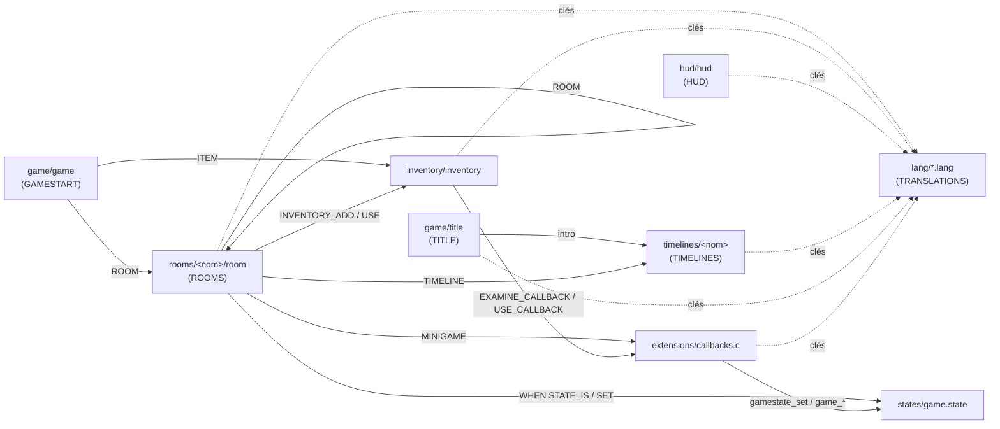

# Développer pour le moteur moteur-3ds

Ce document s'adresse aux développeurs qui veulent modifier le jeu ou
écrire une nouvelle aventure avec ce moteur. Il explique comment les
fichiers de description se répondent les uns aux autres, puis détaille
la partie qui demande du C : les **extensions** (`extensions/`), c'est-à-dire
les mini-jeux et les callbacks d'inventaire.

Chaque format de fichier a sa propre documentation, référencée au fil
du texte et récapitulée à la fin (section 8).

## 1. Vue d'ensemble

Le moteur est volontairement découpé en deux couches :

-   **les données** (`resources/`) : des fichiers texte déclaratifs
    (pièces, inventaire, HUD, timelines, traductions...) et leurs
    ressources (PNG, `.raw`, `.ogg`). Tout ce qui relève du contenu de
    l'aventure se trouve ici, sans recompiler le moteur... à part pour
    reconstruire la romfs ;
-   **le code** (`source/` pour le moteur, `extensions/` pour le code
    spécifique au jeu). Le moteur ne connaît aucune pièce, aucun objet,
    aucune énigme : il interprète les données. Ce que les données ne
    savent pas exprimer (un clavier à code, un Simon, un piano...) est
    écrit en C dans `extensions/` et branché au moteur par un **nom**.

Ce nom est le seul contrat entre les deux couches : un script dit
`MINIGAME digicode` ou `USE_CALLBACK inject_syringe`, et
`extensions/callbacks.c` associe ce nom à du code.

### 1.1. Démarrage

```text
main()
├── lang_init()                       romfs:/lang/*.lang
├── gamestate_init()                  romfs:/states/game.state
├── audio_init()                      (sans firmware DSP : jeu muet, pas d'erreur)
└── game_init()
    ├── callbacks_init()              init() de chaque callback d'inventaire
    ├── game_config_load()            romfs:/game/game
    ├── inventory_init()              romfs:/inventory/inventory (+ résolution des callbacks)
    ├── hud_init()                    romfs:/hud/hud
    └── game_title_start()            romfs:/game/title
```

Puis, à chaque nouvelle partie (`game_start`) ou chargement
(`game_load`) : `callbacks_reset()`, remise à zéro de l'inventaire, des
états et du chronomètre, puis entrée dans la pièce indiquée par
`romfs:/game/game` (ou restauration de la sauvegarde).

À la sortie, `main()` appelle `game_close()` avant `audio_close()` et
`C2D_Fini()` : il ferme le mini-jeu actif, la pièce, l'écran titre, la
timeline et la musique, puis le HUD, l'inventaire et, en dernier, chaque
callback d'inventaire (`callbacks_close()`).

### 1.2. Les modes de jeu

Toute la boucle de jeu est pilotée par `GameMode` (`source/game.h`).
C'est la clé pour comprendre qui reçoit les touches à un instant donné :

| Mode            | Qui reçoit l'entrée                                  | Comment on en sort                         |
|-----------------|------------------------------------------------------|--------------------------------------------|
| `GAME_TITLE`    | l'écran titre                                        | nouvelle partie, chargement                |
| `GAME_TIMELINE` | la timeline en cours                                 | `END` (écran titre) ou `RETURN` (le jeu)   |
| `GAME_NORMAL`   | la pièce (déplacements, toucher) et l'inventaire     | une action change de mode                  |
| `GAME_MESSAGE`  | personne : A, B ou toucher ferme le message          | A, B, toucher, START                       |
| `GAME_BUSY`     | personne, le temps d'un `WAIT_SFX`                   | fin du son, puis callback éventuel         |
| `GAME_MINIGAME` | le mini-jeu actif (`update`)                         | `game_minigame_stop()`                     |

Le menu START se superpose à tout ça et prend toutes les touches tant
qu'il est ouvert. La sauvegarde n'est proposée qu'en `GAME_NORMAL` :
**on ne sauvegarde jamais au milieu d'un mini-jeu**, ce qui a des
conséquences pour leur conception (section 5.4).

## 2. De `resources/` à la romfs

Tout le contenu vit dans `resources/`. Le `Makefile` le transforme en
`romfs/`, qui est embarquée dans le `.3dsx` / `.cia` :

-   chaque répertoire qui contient des PNG reçoit un `gfx.t3s` généré
    automatiquement, compilé par `tex3ds` en `gfx.t3x` (la spritesheet)
    et `gfx.h` (la table `#define gfx_<nom>_idx <n>`) ;
-   les `.raw` (effets sonores), `.ogg` (musiques) et fichiers de
    description sont copiés tels quels ;
-   `resources/rooms/hall/door.png` devient donc l'image `door` de la
    spritesheet `romfs:/rooms/hall/gfx.t3x`.

Conséquence directe : **une image se désigne toujours par le nom de son
PNG sans extension**, et seulement dans le répertoire où elle se trouve.
Une pièce ne peut pas utiliser une image d'une autre pièce, ni une image
de l'inventaire.

Ajouter un fichier dans `resources/` ne demande aucune modification du
`Makefile`. Voir [BUILD.fr.md](./BUILD.fr.md) pour la compilation.

> **Durée de vie des images.** `gfxmap_load_assets` remplit un
> `GfxAssets` : la spritesheet et sa propre table nom → index,
> indépendante de tout autre chargement (pièce, timeline, mini-jeu...).
> `gfxmap_get_image` peut donc être appelé à tout moment tant que ces
> assets sont chargés. Un `C2D_Image` reste valide jusqu'à ce que
> `gfxmap_free_assets` libère son `GfxAssets`.

### 2.1. Préparer les sons et les musiques

Le moteur lit deux formats audio, que le `Makefile` copie sans les
convertir. Il faut donc les préparer à l'avance avec **ffmpeg**
(installé sur votre machine ; il ne fait pas partie de la toolchain
devkitPro). Deux scripts de `scripts/` s'en chargent à partir d'un
fichier WAV.

| Usage                                | Format                                       | Script                       |
|--------------------------------------|----------------------------------------------|------------------------------|
| Musique (`MUSIC`, `MUSIC_START`)     | `.ogg` Ogg/Vorbis, mono ou stéréo, toute fréquence | `scripts/music_generator.sh` |
| Effet sonore (`SFX`, `WAIT_SFX`, `sfx_play()`) | `.raw` PCM sans en-tête, mono, 16 bits signé little-endian, 22050 Hz | `scripts/sound_generator.sh` |

**Musiques.**

```sh
scripts/music_generator.sh chemin/vers/background.wav
```

produit `resources/audio/background.ogg` (Vorbis, 64 kbit/s), que le
jeu désigne ensuite par `romfs:/audio/background.ogg`. La commande
lancée est :

```sh
ffmpeg -i background.wav -c:a libvorbis -b:a 64k resources/audio/background.ogg
```

Le nombre de canaux et la fréquence d'échantillonnage de la source sont
conservés. La musique est lue en streaming et **reprend au début** à la
fin du fichier : coupez la source sur un point de boucle propre. Un
fichier de plus de deux canaux est refusé sans message : ajoutez
`-ac 2` à la commande pour une source 5.1. Pour placer la musique
ailleurs (à côté d'une timeline, pour un `MUSIC_START` relatif), lancez
la commande `ffmpeg` vous-même avec le bon chemin de sortie.

**Effets sonores.**

```sh
scripts/sound_generator.sh chemin/vers/door_open.wav rooms/hall
```

Le second argument est le répertoire de destination, relatif à
`resources/` (créé si besoin) : ici `resources/rooms/hall/door_open.raw`,
que la pièce `hall` peut jouer avec `SFX door_open`. La commande lancée
est :

```sh
ffmpeg -i door_open.wav -ac 1 -ar 22050 -f s16le resources/rooms/hall/door_open.raw
```

Un `.raw` n'a pas d'en-tête : rien n'indique son format au moteur. Un
fichier converti avec d'autres réglages est donc quand même joué, mais à
la mauvaise vitesse et à la mauvaise hauteur, ou comme du bruit. Un
effet est chargé entièrement en mémoire à chaque lecture, et quatre
effets au plus sont joués en même temps : gardez-les courts.

**Désigner un son ou une musique.** Dans les fichiers de description, un
son ou une musique s'écrit soit par un nom relatif **sans extension**,
résolu depuis le répertoire du fichier qui l'utilise, soit par un chemin
absolu commençant par `romfs:/`, utilisé exactement tel qu'il est
écrit : aucune extension n'est ajoutée, il faut donc l'écrire en entier
(`romfs:/audio/toto.raw`) :

| Directive                                   | `toto` est résolu en                |
|---------------------------------------------|-------------------------------------|
| `SFX`, `WAIT_SFX` dans `rooms/<pièce>/room` | `romfs:/rooms/<pièce>/toto.raw`     |
| `MUSIC_START`, `SFX` dans `timelines/<nom>/timeline` | `romfs:/timelines/<nom>/toto.ogg` / `.raw` |
| `MUSIC`, `SFX_SELECT`, `SFX_CHOICE` dans `game/title` | `romfs:/game/toto.ogg` / `.raw` |
| `MUSIC` dans `game/game`                    | `romfs:/game/toto.ogg`              |

`romfs:/mypath/toto.raw` (ou `.ogg`) fonctionne partout, ce qui permet
à plusieurs pièces ou timelines de partager un fichier, par exemple dans
`resources/audio/`. Depuis le C, `sfx_play()` et `music_play()`
attendent toujours un chemin absolu complet, extension comprise.

Les deux scripts attendent un fichier `.wav` : le nom de sortie est
celui de l'entrée sans son extension `.wav`. Pour un autre format
source, lancez directement la commande `ffmpeg`.

## 3. Les fichiers de description et leurs liens

### 3.1. Carte des dépendances



En résumé, quatre « espaces de noms » relient tout le monde :

| Espace de noms              | Déclaré dans                         | Utilisé par                                          |
|-----------------------------|--------------------------------------|------------------------------------------------------|
| Identifiants de pièces      | nom du répertoire `rooms/<nom>/`     | `game/game` (`ROOM`), actions `ROOM`, sauvegarde     |
| Identifiants d'objets       | `ITEM <id>` dans `inventory`         | `game/game` (`ITEM`), `INVENTORY_ADD/REMOVE`, `USE`, `WHEN INVENTORY_HAS`, extensions |
| États (flags)               | `states/game.state`                  | `WHEN STATE_IS`, `SET`, extensions (`gamestate_*`)   |
| Clés de traduction          | `lang/*.lang`                        | tous les fichiers de description, extensions (`lang_get`) |

Et deux espaces de noms qui pointent vers le C : les noms de
**mini-jeux** et de **callbacks d'inventaire**, déclarés dans
`extensions/callbacks.c`.

> Aucun de ces liens n'est vérifié globalement à la compilation. Les
> noms de mini-jeux et de callbacks sont vérifiés au chargement : une
> faute de frappe fait échouer le chargement de la pièce ou de
> l'inventaire, avec le numéro de ligne dans les logs. En revanche, un
> état ou une clé de traduction mal orthographié ne produit qu'un
> avertissement, ou rien du tout, et une fonctionnalité qui ne fait
> rien. Dans tous les cas, lisez les logs (section 3.11).

### 3.2. `game/game` — le point d'entrée d'une partie

Indique la première pièce (`ROOM`), la musique de fond (`MUSIC`),
l'inventaire de départ (`ITEM`) et le style des boîtes de message.
→ [GAMESTART.fr.md](./GAMESTART.fr.md)

```text
ROOM hall
MUSIC romfs:/audio/background.ogg
ITEM REVOLVER
```

### 3.3. `game/title` — l'écran titre

Menu, musique, page des contrôles, crédits. C'est lui qui lance la timeline
`intro` puis la partie.
→ [TITLE.fr.md](./TITLE.fr.md)

### 3.4. `rooms/<nom>/room` — les pièces

Le cœur de l'aventure : images conditionnelles, hotspots, blocs `ACTION`
et `USE`, sorties. C'est **le** fichier qui relie tous les autres : il
lit et écrit les états, manipule l'inventaire, affiche des messages,
lance timelines et mini-jeux.
→ [ROOMS.fr.md](./ROOMS.fr.md)

```text
HOTSPOT CRYOROOM_PANEL_CONTROL 145 102 22 26
    MESSAGE CRYOROOM_PANEL_CONTROL_MESSAGE
    ACTION
        WHEN STATE_IS cryoroom_digicode_enabled true
        MINIGAME digicode
    END_ACTION
    ...
END_HOTSPOT
```

Les images d'une pièce sont cherchées dans son propre répertoire, tout
comme ses sons donnés par un nom relatif (`SFX door_open`) ; un son peut
aussi être donné par son chemin absolu (section 2.1).

### 3.5. `inventory/inventory` — le catalogue d'objets

Ce format n'a pas encore de documentation dédiée. Chaque objet est
déclaré ainsi :

```text
ITEM <id> <clé_du_nom>
IMAGE <image>                          # obligatoire, dans resources/inventory/
EXAMINE <clé_de_texte>                 # optionnel : texte affiché à l'examen (X)
DETAIL <image> <x> <y> [FULLSCREEN]    # optionnel : image affichée à l'examen
EXAMINE_CALLBACK <nom>                 # optionnel : dessin C pendant l'examen
USE_CALLBACK <nom>                     # optionnel : remplace l'utilisation (A)
END_ITEM
```

Exemple réel :

```text
ITEM PAPER ITEM_PAPER
IMAGE paper
EXAMINE ITEM_PAPER_EXAMINE
EXAMINE_CALLBACK secret_code
END_ITEM
```

L'`<id>` est celui que les pièces utilisent (`INVENTORY_ADD PAPER`,
`USE PAPER`). Un objet n'est examinable que s'il a au moins un
`DETAIL`, un `EXAMINE` ou un `EXAMINE_CALLBACK`. Les callbacks sont
détaillés en section 6.

### 3.6. `hud/hud` — l'interface de l'écran supérieur

Positions et images de l'inventaire, des directions, de l'objet
sélectionné, de la cible et du chronomètre. Purement visuel : il ne
référence que des images de `resources/hud/` et des clés de traduction.
→ [HUD.fr.md](./HUD.fr.md)

### 3.7. `timelines/<nom>` — les séquences scénarisées

Introduction, fins, game overs, cinématiques. Lancées par l'écran titre,
par l'action `TIMELINE` d'une pièce, par le timer du HUD, ou depuis le C
avec `game_timeline_start()`. La dernière ligne du script décide de la
suite : `END` ramène à l'écran titre, `RETURN` ramène dans la pièce d'où
la timeline a été lancée.
→ [TIMELINES.fr.md](./TIMELINES.fr.md)

### 3.8. `states/game.state` — les états de progression

Liste de flags booléens, un par ligne, avec leur type :

```text
livingroom_piano_opened TOGGLE
livingroom_secret_passage_opened KEEP
```

-   `TOGGLE` : chaque `SET` inverse la valeur (porte ouverte/fermée) ;
-   `KEEP` : le premier `SET` met à `true`, les suivants ne font rien
    (événement irréversible).

Tous les flags valent `false` au début d'une partie. Seuls les flags à
`true` sont sauvegardés. Un flag doit être déclaré ici avant d'être
utilisé, dans une pièce comme dans une extension. Les subtilités de
`SET` sont décrites dans [ROOMS.fr.md](./ROOMS.fr.md).

### 3.9. `lang/*.lang` — les traductions

Des lignes `CLÉ=valeur`, un fichier par langue. Toute chaîne visible
passe par une clé, y compris celles des extensions (`lang_get`). Une clé
absente s'affiche telle quelle, ce qui rend les oublis faciles à
repérer en jeu.
→ [TRANSLATIONS.fr.md](./TRANSLATIONS.fr.md)

### 3.10. Fil rouge : du papier à la fin du jeu

Pour voir tous ces fichiers travailler ensemble, suivons le code secret :

1.  Au début de chaque partie, `callbacks_reset()` appelle
    `secret_code_reset()`, qui tire un code à 4 chiffres
    (`extensions/secret_code.c`).
2.  Une pièce donne l'objet `PAPER` (`INVENTORY_ADD PAPER`).
3.  Le joueur l'examine : l'inventaire affiche `ITEM_PAPER_EXAMINE`
    (traduction) puis appelle `secret_code_draw()`, déclaré par
    `EXAMINE_CALLBACK secret_code`, qui dessine le code.
4.  Dans la `cryoroom`, le hotspot du panneau lance `MINIGAME digicode`.
5.  `digicode` compare la saisie à `secret_code_get()`. En cas de
    succès, il lit l'état `item_syringe_injected`...
6.  ...positionné par l'objet `SYRINGE` (`USE_CALLBACK inject_syringe`
    → `syringe_use()` → `gamestate_set("item_syringe_injected")`).
7.  Selon cet état, `digicode` lance la timeline `ending` ou
    `gameover_bacteria`.
8.  Si le joueur sauvegarde entre-temps, le code est écrit dans la
    sauvegarde (`CALLBACK secret_code 4821`) grâce à
    `secret_code_serialize()`, et relu par `secret_code_deserialize()`.

Quatre fichiers de données, trois extensions, un état, un objet : c'est
exactement le genre de chaîne qu'on construit pour une énigme.

### 3.11. Lire les logs

Toutes les erreurs de chargement (fichier, numéro de ligne, nom
inconnu) et les avertissements du moteur passent par `printf`. Sur la
console, cette sortie n'est visible que dans une version compilée avec
`DEBUG` : `main.c` redirige alors `stdout` et `stderr` vers la machine
qui a envoyé le jeu avec `3dslink`.

Pour recevoir ces messages, il faut lancer le jeu avec
**`3dslink --server`** (forme courte : `-s`). Sans cette option,
`3dslink` se termine dès que le `.3dsx` est envoyé, et plus personne
n'écoute les logs.

```sh
make DEBUG=1
3dslink --server -a <ip_de_la_3ds> moteur.3dsx
```

La 3DS doit être sur le Homebrew Launcher, en attente réseau (touche
Y). Les logs s'affichent ensuite dans le terminal jusqu'à la fermeture
du jeu, par exemple :

```text
romfs:/rooms/cellar/room:87: unknown mini-game switchbaord
Cannot load rooms: romfs:/rooms/cellar
```

## 4. Les extensions : principe

Le répertoire `extensions/` contient tout le code spécifique à
l'aventure. Il est compilé avec le moteur (`SOURCES := source extensions`
dans le `Makefile`), rien à configurer.

Le seul point d'entrée est le registre `extensions/callbacks.c`, qui
expose deux tables :

```c
static MiniGameCallback minigame_callbacks[] = {
    { "simon",    &simon },
    { "piano",    &piano },
    { "measure",  &measure },
    { "digicode", &digicode }
};

static InventoryCallback inventory_callbacks[] = {
    {
        .name = "secret_code",
        .init = secret_code_init,
        .close = secret_code_close,
        .reset = secret_code_reset,
        .callback = secret_code_draw,
        .serialize = secret_code_serialize,
        .deserialize = secret_code_deserialize
    },
    {
        .name = "inject_syringe",
        .callback = syringe_use
    }
};
```

Le moteur, lui, ne voit que l'interface de `source/callbacks.h` :

| Fonction                         | Appelée par                       | Rôle                                                    |
|----------------------------------|-----------------------------------|---------------------------------------------------------|
| `callbacks_minigame_find(name)`  | `game_minigame_start`             | nom → `MiniGame *`, ou `NULL` (loggé)                   |
| `callbacks_inventory_find(name)` | `inventory_init`                  | nom → fonction `callback`, ou `NULL` (loggé)            |
| `callbacks_init()`               | `game_init`, une fois             | appelle chaque `init` d'un callback d'inventaire        |
| `callbacks_reset()`              | `game_start` / `game_load`        | appelle chaque `reset`                                  |
| `callbacks_close()`              | `game_close`, une fois à la sortie | appelle chaque `close`                                 |
| `callbacks_get_count/index()`    | `save.c`                          | parcourt les callbacks pour `serialize`/`deserialize`   |

Ajouter une extension, c'est donc toujours la même recette :

1.  écrire `extensions/<nom>.c` et `extensions/<nom>.h` ;
2.  l'inclure et l'enregistrer dans `extensions/callbacks.c` ;
3.  la référencer par son nom dans les données (`MINIGAME <nom>`,
    `EXAMINE_CALLBACK <nom>` ou `USE_CALLBACK <nom>`) ;
4.  ajouter ses ressources, ses états et ses clés de traduction.

## 5. Les mini-jeux

### 5.1. Le contrat `MiniGame`

```c
typedef struct {
    bool (*init)(void);
    void (*update)(u32 keys, touchPosition touch);
    void (*draw)(void);
    void (*close)(void);
} MiniGame;
```

Les quatre pointeurs sont optionnels, mais un mini-jeu sans `update` ne
peut pas se terminer tout seul.

| Callback | Quand                                               | Ce qu'on y fait                                         |
|----------|-----------------------------------------------------|---------------------------------------------------------|
| `init`   | une fois, au lancement par `MINIGAME <nom>`         | charger les ressources, remettre l'état du jeu à zéro. Retourner `false` annule le lancement. |
| `update` | chaque frame                                        | lire les entrées, faire avancer la logique, décider de la fin |
| `draw`   | chaque frame, sur l'écran **inférieur**, après la pièce | dessiner par-dessus la pièce                       |
| `close`  | à `game_minigame_stop()`, **et aussi si `init` échoue**, au lancement d'une timeline (temps écoulé, ou `game_timeline_start()` appelé par le mini-jeu) et quand le joueur quitte pendant le mini-jeu | libérer tout ce que `init` a alloué                 |

### 5.2. Cycle de vie

```text
Action MINIGAME simon (pièce)
 └─ game_minigame_start("simon")
     ├─ callbacks_minigame_find("simon")   (nom déjà vérifié au chargement de la pièce)
     ├─ music_stop()
     ├─ simon.init()                       false → game_minigame_stop() → simon.close()
     └─ game_mode = GAME_MINIGAME

Chaque frame :
 ├─ simon.update(hidKeysDown(), touch)
 └─ dessin : room_draw() → simon.draw() → hud_draw() (écran supérieur)

Fin, depuis update :
 └─ game_minigame_stop()
     ├─ simon.close()
     ├─ music_play(musique du jeu)
     └─ game_mode = GAME_NORMAL
```

Points importants :

-   `MINIGAME` est une **action terminale** dans une pièce : les actions
    qui la suivent dans le bloc ne sont pas exécutées (voir
    [ROOMS.fr.md](./ROOMS.fr.md)). Tout ce qui doit se passer *après*
    le mini-jeu est donc à la charge du C.
-   `keys` contient les touches **pressées pendant cette frame**
    (`hidKeysDown`), pas les touches maintenues. Pour réagir à un appui
    sur l'écran tactile, testez `keys & KEY_TOUCH` ; `touch` contient
    alors la position. Sans `KEY_TOUCH`, `touch` vaut `(0, 0)` quand
    rien ne touche l'écran.
-   L'écran supérieur continue d'afficher le HUD. L'écran inférieur
    affiche la pièce, puis votre `draw` : dessinez avec une profondeur
    élevée (`0.9f` et plus) pour passer devant.
-   La musique est coupée pendant le mini-jeu (ce qui laisse les canaux
    au piano) et relancée par `game_minigame_stop()`.

### 5.3. Terminer un mini-jeu : l'ordre compte

`game_minigame_stop()` repasse en `GAME_NORMAL`. Tout ce qui change de
mode (message, timeline, changement de pièce) doit donc venir **après** :

```c
static void simon_stop(bool success) {
    game_minigame_stop();                       // close(), GAME_NORMAL
    if (success) {
        game_show_message("CELLAR_SIMON_WIN");  // GAME_MESSAGE
    }
}
```

Dans l'autre ordre, le message serait affiché puis immédiatement effacé
par le retour en `GAME_NORMAL`.

De même, après `game_minigame_stop()`, `close` a déjà libéré vos
ressources : sortez de `update` sans plus rien toucher (`return`).

Les conséquences d'une victoire se traduisent en général par :

-   `gamestate_set("...")` : la pièce réagit via ses `WHEN STATE_IS`
    (c'est ce que fait `piano` pour le passage secret) ;
-   `game_show_message("...")` : un retour au joueur ;
-   `game_timeline_start("...", NULL)` : une fin ou un game over (`digicode`).
    Le mini-jeu est d'abord fermé, donc `update` doit rendre la main tout
    de suite, comme après `game_minigame_stop()` ; une timeline qui finit
    par `RETURN` ramène le joueur dans la pièce, pas dans le mini-jeu ;
-   `inventory_add("...")` : une récompense.

### 5.4. Règles de conception

-   **Ressources.** Mettez images et sons dans
    `resources/minigames/<nom>/`. Chargez la spritesheet dans `init`
    avec `gfxmap_load_assets("romfs:/minigames/<nom>", &assets)` et
    résolvez les images utiles (section 2), en général tout de suite.
-   **`close` doit supporter un `init` partiel.** Il est appelé même si
    `init` a échoué à mi-chemin : testez chaque ressource avant de la
    libérer et remettez le pointeur à `NULL`.
-   **Réinitialisez l'état dans `init`**, pas à la déclaration : le
    même mini-jeu peut être lancé plusieurs fois dans une partie.
-   **Le mini-jeu n'est pas sauvegardé.** On ne peut pas sauvegarder
    pendant un mini-jeu, et son état interne est perdu à la sortie. Ce
    qui doit survivre passe par un état (`gamestate_set`) ou par
    l'inventaire.
-   **Sons.** `sfx_play()` attend un chemin romfs complet
    (`"romfs:/minigames/digicode/beep.raw"`), au format mono 16 bits
    signé 22050 Hz (voir section 2.1). Pour piloter NDSP directement
    (comme `piano`), vérifiez d'abord `audio_is_available()`.
-   **Textes.** Allouez votre `C2D_TextBuf` dans `init` (ou une seule
    fois, voir `digicode`), libérez-le dans `close`, et passez par
    `lang_get()` pour toute chaîne visible (voir `measure`).
-   **Toujours une sortie.** Prévoyez une touche pour abandonner
    (B dans tous les mini-jeux existants), sinon le joueur est coincé.

### 5.5. Les mini-jeux existants

| Nom        | Fichier                  | Intérêt comme modèle                                             |
|------------|--------------------------|------------------------------------------------------------------|
| `digicode` | `extensions/digicode.c`  | le plus simple : clavier tactile, sons, lecture d'un état, lancement de timeline |
| `measure`  | `extensions/measure.c`   | pas de spritesheet, dessin de primitives, texte traduit          |
| `simon`    | `extensions/simon.c`     | machine à états temporisée (`osGetTime`)                         |
| `piano`    | `extensions/piano.c`     | pilotage direct de NDSP, plusieurs canaux                        |

### 5.6. Exemple complet : un tableau électrique

Un mini-jeu fictif : trois interrupteurs, il faut trouver la bonne
combinaison pour rétablir le courant.

**`extensions/switchboard.h`**

```c
// switchboard.h
#pragma once

#include "game.h"

extern MiniGame switchboard;
```

**`extensions/switchboard.c`**

```c
// switchboard.c
#include <3ds.h>
#include <citro2d.h>
#include <string.h>
#include "switchboard.h"
#include "audio.h"
#include "game.h"
#include "gamestate.h"
#include "gfxmap.h"

#define SWITCH_COUNT   3
#define SWITCH_LEFT    70.0f
#define SWITCH_TOP     90.0f
#define SWITCH_WIDTH   40.0f
#define SWITCH_HEIGHT  60.0f
#define SWITCH_SPACING 25.0f

static const bool solution[SWITCH_COUNT] = { true, false, true };

static GfxAssets assets;
static C2D_Image img_background;
static C2D_Image img_up;
static C2D_Image img_down;
static bool switches[SWITCH_COUNT];

static bool switchboard_init(void) {
    if (!gfxmap_load_assets("romfs:/minigames/switchboard", &assets)) {
        return false;
    }
    img_background = gfxmap_get_image(&assets, "background");
    img_up = gfxmap_get_image(&assets, "switch_up");
    img_down = gfxmap_get_image(&assets, "switch_down");
    if (!img_background.tex || !img_up.tex || !img_down.tex) {
        return false;  // close() frees the spritesheet
    }
    memset(switches, 0, sizeof(switches));
    return true;
}

static void switchboard_stop(bool success) {
    game_minigame_stop();
    if (success) {
        gamestate_set("cellar_power_restored");
        game_show_message("CELLAR_SWITCHBOARD_SOLVED");
    }
}

static int switch_at(touchPosition touch) {
    for (int i = 0; i < SWITCH_COUNT; i++) {
        float x = SWITCH_LEFT + i * (SWITCH_WIDTH + SWITCH_SPACING);
        if (touch.px >= x && touch.px < x + SWITCH_WIDTH &&
            touch.py >= SWITCH_TOP && touch.py < SWITCH_TOP + SWITCH_HEIGHT) {
            return i;
        }
    }
    return -1;
}

static void switchboard_update(u32 keys, touchPosition touch) {
    if (keys & KEY_B) {
        switchboard_stop(false);
        return;
    }
    if (!(keys & KEY_TOUCH)) {
        return;
    }
    int i = switch_at(touch);
    if (i < 0) {
        return;
    }
    switches[i] = !switches[i];
    sfx_play("romfs:/minigames/switchboard/click.raw");
    if (memcmp(switches, solution, sizeof(switches)) == 0) {
        switchboard_stop(true);
    }
}

static void switchboard_draw(void) {
    C2D_DrawImageAt(img_background, 0.0f, 0.0f, 0.9f, NULL, 1.0f, 1.0f);
    for (int i = 0; i < SWITCH_COUNT; i++) {
        float x = SWITCH_LEFT + i * (SWITCH_WIDTH + SWITCH_SPACING);
        C2D_DrawImageAt(switches[i] ? img_up : img_down, x, SWITCH_TOP, 0.91f, NULL, 1.0f, 1.0f);
    }
}

static void switchboard_close(void) {
    gfxmap_free_assets(&assets);  // harmless if init failed
}

MiniGame switchboard = {
    .init = switchboard_init,
    .update = switchboard_update,
    .draw = switchboard_draw,
    .close = switchboard_close
};
```

**Enregistrement dans `extensions/callbacks.c`**

```c
#include "switchboard.h"

static MiniGameCallback minigame_callbacks[] = {
    { "simon",       &simon },
    { "piano",       &piano },
    { "measure",     &measure },
    { "digicode",    &digicode },
    { "switchboard", &switchboard }
};
```

**Ressources**

```text
resources/minigames/switchboard/
├── background.png      320×240, écran inférieur
├── switch_up.png
├── switch_down.png
└── click.raw           mono, 16 bits signé, 22050 Hz
```

**État** dans `resources/states/game.state` :

```text
cellar_power_restored KEEP
```

**Pièce** (`resources/rooms/cellar/room`) : le hotspot disparaît une
fois l'énigme résolue, et une image montre la lumière revenue.

```text
IMAGE lights_on 0 0 0.2
    WHEN STATE_IS cellar_power_restored true
END_IMAGE

HOTSPOT CELLAR_SWITCHBOARD 200 80 40 50
    WHEN STATE_IS cellar_power_restored false
    MESSAGE CELLAR_SWITCHBOARD_EXAMINE
    ACTION
        MINIGAME switchboard
    END_ACTION
END_HOTSPOT
```

**Traductions**, dans chaque fichier de `resources/lang/` :

```text
CELLAR_SWITCHBOARD=Un tableau électrique
CELLAR_SWITCHBOARD_EXAMINE=Trois interrupteurs.\nUn seul ordre est le bon.
CELLAR_SWITCHBOARD_SOLVED=La lumière revient dans la cave.
```

Aucune modification du moteur ni du `Makefile` n'est nécessaire.

## 6. Les callbacks d'inventaire

### 6.1. Le contrat `InventoryCallback`

```c
typedef struct {
    const char *name;
    void (*init)(void);     // once per session (allocations)
    void (*close)(void);    // once at exit (frees what init allocated)
    void (*reset)(void);    // at the start of every game (game state)
    void (*callback)(void);
    char* (*serialize)(void);
    void (*deserialize)(const char*);
} InventoryCallback;
```

| Champ         | Quand                                                       | Contrat                                                  |
|---------------|-------------------------------------------------------------|----------------------------------------------------------|
| `name`        | —                                                           | nom utilisé par `EXAMINE_CALLBACK` / `USE_CALLBACK`, et clé dans la sauvegarde |
| `init`        | une fois, dans `game_init` (citro2d déjà initialisé)        | allocations durables (`C2D_TextBuf`...)                  |
| `close`       | une fois, dans `game_close` à la sortie (citro2d encore initialisé) | libérer ce que `init` a alloué ; appelé même si `init` n'a pas tourné : tester chaque ressource et remettre le pointeur à `NULL` |
| `reset`       | au début de chaque partie, **avant** un chargement          | remettre l'état à zéro, tirer un nouvel aléa             |
| `callback`    | voir 6.2 et 6.3                                             | le comportement lui-même                                 |
| `serialize`   | à chaque sauvegarde                                         | retourner une chaîne `malloc`ée (libérée par l'appelant) |
| `deserialize` | au chargement, après `reset`                                | restaurer l'état depuis cette chaîne                     |

Tous les champs sauf `name` sont optionnels. Point important :
`init`, `reset`, `serialize` et `deserialize` sont appelés pour
**toutes** les entrées de la table, que le joueur possède l'objet ou
non. Un callback d'inventaire est donc aussi le moyen d'avoir un état
d'extension sauvegardé (c'est le cas de `secret_code`, qui sert au
`digicode` bien avant que le papier soit ramassé).

### 6.2. `EXAMINE_CALLBACK` : dessiner pendant l'examen

Quand le joueur examine l'objet (X), le HUD dessine sur **l'écran
supérieur**, dans cet ordre : le fond d'examen, l'image `DETAIL`, le
texte `EXAMINE`, puis votre callback. Il est appelé **à chaque frame**
tant que l'examen dure : ne faites que du dessin, pas de logique.

```c
void secret_code_draw(void) {
    char code[5];
    for (int i = 0; i < 4; i++) {
        code[i] = '0' + secret_code[i];
    }
    code[4] = '\0';
    C2D_TextBufClear(text_buf);
    C2D_TextParse(&text, text_buf, code);
    C2D_TextOptimize(&text);
    C2D_DrawText(&text, C2D_WithColor, 40.0f, 100.0f, 0.9f, 0.55f, 0.55f,
                 C2D_Color32(192, 192, 192, 255));
}
```

Le `text_buf` est créé une seule fois dans `secret_code_init()` : pas
d'allocation à chaque frame. Coordonnées : l'écran supérieur fait
400×240.

### 6.3. `USE_CALLBACK` : remplacer l'utilisation

Normalement, utiliser un objet (A) exécute le bloc `USE <objet>` de la
cible courante (`game_use_item`). Avec un `USE_CALLBACK`, votre
fonction est appelée **à la place**, une fois, en `GAME_NORMAL`. Elle
peut faire n'importe quoi avec l'API publique :

```c
void syringe_use(void) {
    inventory_remove("SYRINGE");
    gamestate_set("item_syringe_injected");
    game_show_message("ITEM_SYRINGE_USED");
}
```

Pour **ajouter** un comportement sans perdre celui de la pièce, appelez
vous-même `game_use_item(id)`, qui retourne `true` si un bloc `USE` a
été exécuté (voir l'exemple 6.5).

### 6.4. Sauvegarde : `serialize` / `deserialize`

La sauvegarde est un fichier texte. Chaque callback qui a un
`serialize` y écrit une ligne :

```text
TIME 1834221
ROOM cryoroom
ITEM PAPER
STATE livingroom_piano_opened
CALLBACK secret_code 4821
```

Contraintes sur la chaîne retournée par `serialize` :

-   allouée avec `malloc`, elle est libérée par `save_write` ;
-   elle peut être **vide** : `deserialize` recevra alors `""` au
    chargement ;
-   **sans retour à la ligne**, et courte (la ligne complète est lue
    dans un tampon de 256 octets). Les espaces sont acceptés ;
-   retourner `NULL` fait échouer la sauvegarde (l'ancienne est
    conservée).

Côté `deserialize`, la chaîne vient d'un fichier sur la carte SD :
**validez-la** (longueur, plage de valeurs) avant de l'utiliser, et
acceptez la chaîne vide `""` : elle arrive quand `serialize` a retourné
une chaîne vide, ou quand la ligne de sauvegarde a perdu sa donnée.
`reset` a été appelé juste avant, donc en cas de donnée invalide, il
suffit de ne rien faire pour garder un état cohérent. Les données d'un
callback qui n'existe plus sont ignorées.

> Renommer un callback (`name`) rend les anciennes sauvegardes muettes
> pour lui : ses données seront ignorées et l'état repartira de `reset`.

### 6.5. Exemple complet : un briquet à usage limité

Un callback fictif (le briquet du jeu n'en a pas) : le briquet ne
fonctionne que trois fois, et le compteur survit à la sauvegarde.

**`extensions/lighter.h`**

```c
// lighter.h
#pragma once

void lighter_reset(void);
void lighter_use(void);
char *lighter_serialize(void);
void lighter_deserialize(const char *data);
```

**`extensions/lighter.c`**

```c
// lighter.c
#include <stdio.h>
#include <stdlib.h>
#include "lighter.h"
#include "game.h"

#define LIGHTER_MAX_USES 3

static int uses_left;

void lighter_reset(void) {
    uses_left = LIGHTER_MAX_USES;
}

void lighter_use(void) {
    if (uses_left == 0) {
        game_show_message("ITEM_LIGHTER_EMPTY");
        return;
    }
    // Keep the room's USE LIGHTER blocks; only a use that did something
    // costs a charge.
    if (game_use_item("LIGHTER")) {
        uses_left--;
    }
}

char *lighter_serialize(void) {
    char *data = malloc(4);
    if (!data) {
        return NULL;
    }
    snprintf(data, 4, "%d", uses_left);
    return data;
}

void lighter_deserialize(const char *data) {
    char *end;
    long value = strtol(data, &end, 10);
    if (end != data && value >= 0 && value <= LIGHTER_MAX_USES) {
        uses_left = (int)value;
    }
}
```

**Enregistrement dans `extensions/callbacks.c`**

```c
#include "lighter.h"

static InventoryCallback inventory_callbacks[] = {
    /* ... entrées existantes ... */
    {
        .name = "lighter",
        .reset = lighter_reset,
        .callback = lighter_use,
        .serialize = lighter_serialize,
        .deserialize = lighter_deserialize
    }
};
```

**Inventaire** (`resources/inventory/inventory`) :

```text
ITEM LIGHTER ITEM_LIGHTER
IMAGE lighter
USE_CALLBACK lighter
END_ITEM
```

**Traductions** : `ITEM_LIGHTER_EMPTY=Le briquet est vide.`

### 6.6. Limites actuelles

-   Une entrée n'a qu'**une** fonction `callback`. Un objet qui a besoin
    d'un `EXAMINE_CALLBACK` *et* d'un `USE_CALLBACK` utilise deux
    entrées, avec deux noms différents (une seule portant `serialize`).
-   Les noms sont résolus au chargement de l'inventaire. Un nom inconnu
    fait échouer ce chargement, donc le démarrage du jeu, avec
    `inventory:<ligne>: unknown callback: <nom>` dans les logs.
-   `GameCallbackEntry`, déclaré dans `game.h`, n'est utilisé nulle
    part.

## 7. L'API publique des extensions

Les extensions n'accèdent au moteur que par ces en-têtes. Tout le reste
(`room.h`, `hud.h`, `title.h`...) est interne.

### `game.h` — modes et flux de jeu

| Fonction                                   | Effet                                                                       |
|--------------------------------------------|-----------------------------------------------------------------------------|
| `game_show_message(key)`                   | affiche un message traduit, passe en `GAME_MESSAGE`                         |
| `game_show_image(image)`                   | affiche une image centrée ; elle doit rester valide jusqu'à la fermeture    |
| `game_minigame_start(name)`                | lance un autre mini-jeu                                                     |
| `game_minigame_stop()`                     | termine le mini-jeu courant (section 5.3)                                   |
| `game_timeline_start(name, callback)`      | lance `romfs:/timelines/<name>` ; en cas d'échec, retour à l'écran titre. Ferme le mini-jeu actif, s'il y en a un. À la fin, `END` ramène à l'écran titre ; `RETURN` ramène dans la pièce, puis appelle `callback` (peut valoir `NULL`), qui n'est jamais appelé après `END` ni en cas d'échec |
| `game_set_room(name)`                      | change de pièce                                                             |
| `game_use_item(id)`                        | exécute le bloc `USE` de la cible ; `true` si un bloc a été exécuté         |
| `game_target_name()`                       | identifiant du hotspot ciblé, ou `NULL`                                     |
| `game_wait_for_sfx(path, callback)`        | joue un son, bloque l'entrée jusqu'à sa fin, puis appelle `callback`        |

Une seule règle : **le dernier changement de mode de la frame gagne**.
Un `game_show_message` suivi d'un `game_timeline_start` ne montrera
jamais le message.

### `gamestate.h` — états

`gamestate_get(name)` et `gamestate_set(name)`. `set` respecte le type
déclaré : sur un flag `TOGGLE`, il **inverse** la valeur. Un nom non
déclaré dans `game.state` est loggé et ignoré.

### `inventory.h` — objets du joueur

`inventory_add(id)`, `inventory_remove(id)`, `inventory_has(id)`,
`inventory_get_selected_item()`.

### `audio.h` — son

`sfx_play(path)` (retourne un canal ou `-1`), `sfx_is_playing(ch)`,
`sfx_stop(ch)`, `music_play(path)`, `music_stop()`,
`audio_is_available()`, `audio_resolve_path(...)`.

### `lang.h` — traductions

`lang_get(key)` retourne la traduction, ou la clé elle-même. Le
pointeur est invalidé par un changement de langue : ne le gardez pas
d'une frame à l'autre, rappelez `lang_get`.

### `gfxmap.h` — images

`gfxmap_load_assets(path, &assets)`, `gfxmap_get_image(&assets, name)`,
`gfxmap_free_assets(&assets)`, `gfxmap_parse_color(name)`. Voir la
section 2 pour la durée de vie des images.

### Entre extensions

Une extension peut exposer ses propres fonctions aux autres :
`secret_code.h` publie `secret_code_get()`, utilisé par `digicode.c`.
C'est la bonne manière de partager un état entre un callback
d'inventaire (sauvegardé) et un mini-jeu (non sauvegardé).

## 8. Check-list et documentation de référence

### Avant de lancer le jeu

-   [ ] Chaque état utilisé est déclaré dans `states/game.state`, avec
    le bon type (`TOGGLE` ou `KEEP`).
-   [ ] Chaque clé de traduction existe dans **tous** les fichiers de
    `lang/`.
-   [ ] Aucune `C2D_Image` n'est utilisée après que
    `gfxmap_free_assets` a libéré son `GfxAssets`.
-   [ ] `close` supporte un `init` interrompu.
-   [ ] Les changements de mode viennent après `game_minigame_stop()`.
-   [ ] `serialize` retourne une chaîne sans `\n`, et `deserialize`
    accepte `""`.
-   [ ] Les logs (`DEBUG=1` et `3dslink --server`, section 3.11) ne
    contiennent ni `not found` ni `unknown`.

### Documentation des formats

| Fichier                         | Documentation                                   |
|---------------------------------|-------------------------------------------------|
| `resources/game/game`           | [GAMESTART.fr.md](./GAMESTART.fr.md)            |
| `resources/game/title`          | [TITLE.fr.md](./TITLE.fr.md)                    |
| `resources/rooms/<nom>/room`    | [ROOMS.fr.md](./ROOMS.fr.md)                    |
| `resources/hud/hud`             | [HUD.fr.md](./HUD.fr.md)                        |
| `resources/timelines/<nom>`     | [TIMELINES.fr.md](./TIMELINES.fr.md)            |
| `resources/lang/*.lang`         | [TRANSLATIONS.fr.md](./TRANSLATIONS.fr.md)      |
| `resources/inventory/inventory` | section 3.5 de ce document                      |
| `resources/states/game.state`   | section 3.8 de ce document                      |
| Compilation et tests            | [BUILD.fr.md](./BUILD.fr.md)                    |
| Jouer                           | [HOWTOPLAY.fr.md](./HOWTOPLAY.fr.md)            |
